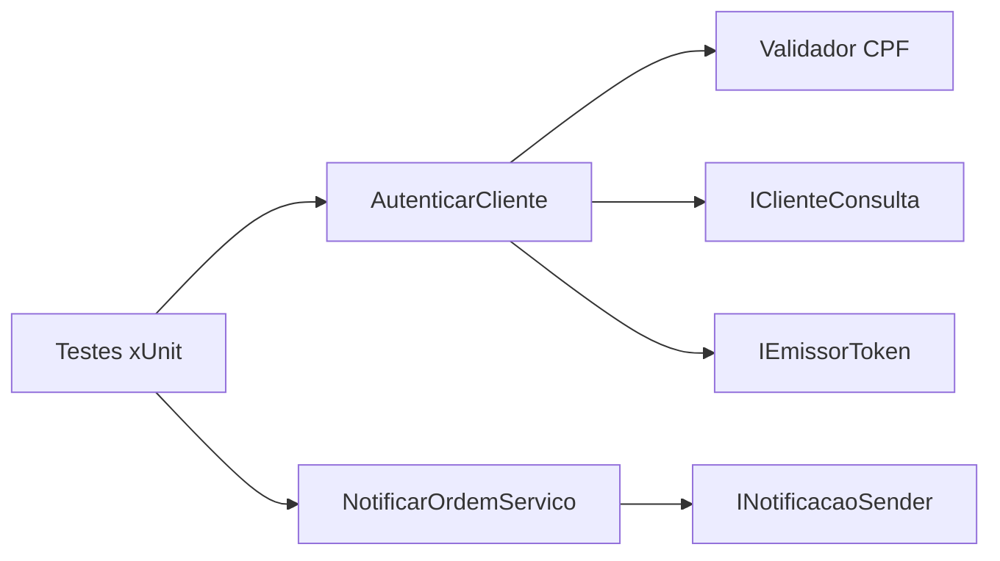
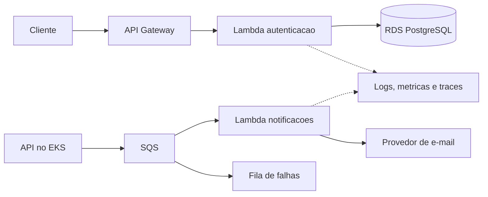

# Oficina Serverless

Base das funcoes de autenticacao por CPF e notificacoes de ordens de servico
do Tech Challenge. A aplicacao principal permanece em
[Oficina-Mecanica](https://github.com/Venomouus/Oficina-Mecanica).

## Estado deste PR

Implementado:
- Bibliotecas .NET 8 para os casos de uso de autenticacao e notificacao.
- Validacao e normalizacao de CPF, autorizacao por existencia/status do cliente
  e contratos para consulta e emissao de token.
- Validacao da notificacao e contrato para o provedor de envio.
- Testes unitarios sem AWS, banco ou envio de e-mail.
- Base de nomenclatura Terraform e CI para build, testes e validacao Terraform.

Ainda pendente:
- Handlers/serializacao da Lambda e empacotamento implantavel.
- Consulta real ao RDS, assinatura JWT, descoberta do emissor e JWKS.
- Consumo SQS, idempotencia, envio real, logs e traces.
- Recursos AWS em Terraform, estado remoto, OIDC e CD dos dois ambientes.

As interfaces externas possuem implementacoes falsas apenas nos testes.
Nao ha servidor HTTP executavel, JWT real ou notificacao enviada nesta etapa.
A pasta Terraform ainda nao provisiona infraestrutura.

## Tecnologias

C#, .NET 8, xUnit, Terraform e GitHub Actions. AWS Lambda, API Gateway,
SQS, PostgreSQL/RDS e observabilidade fazem parte da arquitetura de destino.

## Estrutura

```text
src/
  Oficina.Autenticacao/       # CPF, caso de uso e interfaces
  Oficina.Notificacoes/       # Evento, caso de uso e interface de envio
tests/
  Oficina.Serverless.Tests/
infra/                       # Nomenclatura e validacao Terraform
config/serverless.example.json
docs/contratos.md
.github/workflows/ci.yml
```

## Arquitetura

Componentes locais implementados:



Arquitetura AWS planejada:



## Executar e testar localmente

Instale o SDK .NET 8 e, para validar infra, Terraform >= 1.6 e < 2.0.

```powershell
dotnet restore Oficina.Serverless.sln
dotnet build Oficina.Serverless.sln --configuration Release --no-restore
dotnet test Oficina.Serverless.sln --configuration Release --no-build
terraform -chdir=infra fmt -check -recursive
terraform -chdir=infra init -backend=false -input=false
terraform -chdir=infra validate
```

Os projetos sao bibliotecas; a execucao local atual ocorre pelos testes.
Nao use `dotnet run` esperando uma API nesta etapa.
Dockerfile nao se aplica a essas bibliotecas; o empacotamento Lambda sera
definido junto aos handlers.

## Configuracao

`config/serverless.example.json` documenta as configuracoes futuras, sem
credenciais reais. Ainda nao e carregado pelos casos de uso. Os adaptadores AWS
definirao como obter esses valores e os segredos no runtime.

Mantenha a variavel de repositorio `DEPLOY_ENABLED=false` no GitHub.
Este PR contem apenas CI, sem job de deploy. A variavel esta reservada para o
CD futuro; muda-la para true agora nao publica nem provisiona recursos.

## CI e branches

Fluxo: `develop -> feature/* -> PR para develop -> PR para master`.

A pipeline roda em PRs destinados a `develop`/`master`, em pushes nessas
branches e manualmente. Um push isolado em `feature/*` roda CI quando existe PR.

Checks para a protecao das duas branches apos a primeira execucao:
- `build-test`: restore, build, testes e artefato TRX.
- `validate-terraform`: fmt, init sem backend e validate.

Exija PR, esses checks, resolucao de conversas e regras sem bypass.
Bloqueie force push e exclusao. Para trabalho individual, nao exija aprovacao
de outro usuario. Os checks Docker/kind da API nao existem neste repositorio.

## Deploy futuro

| Ambiente GitHub | Branch |
|---|---|
| staging | develop |
| producao | master |

Ainda nao ha comando de deploy funcional. Para habilitar CD sera necessario:
1. Implementar e empacotar handlers e adaptadores AWS.
2. Disponibilizar rede, RDS com status do cliente e segredos.
3. Implementar Terraform dos recursos e estado remoto.
4. Configurar OIDC e jobs automaticos que referenciem os ambientes acima.
5. Condicionar esses jobs a push na branch correta e DEPLOY_ENABLED=true.
6. Validar na AWS e registrar URLs e evidencias reais.

[Responsabilidades da infraestrutura](infra/README.md).

## Documentacao das APIs

[Contratos planejados de autenticacao e notificacao](docs/contratos.md).

[Swagger da aplicacao principal e instrucoes](https://github.com/Venomouus/Oficina-Mecanica#collection--swagger).
Nao ha URL ativa da API de autenticacao neste momento.

## Repositorios relacionados

- [Aplicacao principal](https://github.com/Venomouus/Oficina-Mecanica)
- [Infra Kubernetes](https://github.com/Venomouus/Oficina-infra-kubernetes)
- [Infra database](https://github.com/Venomouus/Oficina-infra-database)
