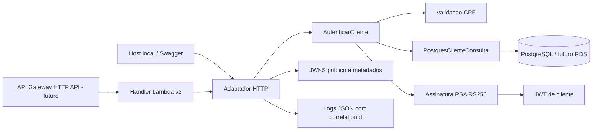

# Oficina Serverless

Autenticacao por CPF e base de notificacoes de ordens de servico do Tech Challenge.
A aplicacao principal permanece em [Oficina-Mecanica](https://github.com/Venomouus/Oficina-Mecanica).

## Implementado

- Validacao do CPF, consulta parametrizada PostgreSQL e verificacao de cliente ativo.
- JWT RS256 com identificador do cliente, perfil `Cliente`, audiencia e validade de 15 minutos.
- Handler Lambda para API Gateway **HTTP API, payload 2.0**.
- Chave publica JWKS, metadados do emissor e logs JSON com correlacao, sem CPF/token.
- Host HTTP local com Swagger para testar a mesma autenticacao sem AWS.
- Testes de dominio, assinatura/verificacao JWT, eventos Lambda e PostgreSQL real.
- CI com PostgreSQL temporario e artefato ZIP da Lambda; validacao da base Terraform.

Ainda pendentes: recursos AWS/Terraform, leitura de segredos via Secrets Manager,
rotacao de chaves, limitacao de tentativas no Gateway, traces distribuidos e CD
automatico dos ambientes. Notificacoes ainda possuem somente caso de uso e testes.
O JWT de cliente **ainda nao e aceito pela API principal**, que usa outra assinatura:
a validacao RSA, os papeis e a verificacao de propriedade da OS serao integrados nela.

## Tecnologias e estrutura

C#, .NET 8, Npgsql 8, Microsoft IdentityModel, AWS Lambda SDK, xUnit,
PostgreSQL 16 para testes, Terraform e GitHub Actions.

```text
src/Oficina.Autenticacao/       # Caso de uso, PostgreSQL, RSA, HTTP e handler Lambda
src/Oficina.Autenticacao.Local/ # Host HTTP/Swagger e geracao de chave local
src/Oficina.Notificacoes/      # Base do caso de uso; envio real ainda pendente
tests/Oficina.Serverless.Tests/
scripts/test-postgres.ps1      # Testes em container descartavel
infra/                        # Base Terraform; ainda nao provisiona AWS
config/serverless.example.json
docs/contratos.md
docs/openapi.yaml
docs/adrs/001-autenticacao-cpf-rsa.md
```

## Arquitetura deste repositorio



## Executar localmente

Use SDK .NET 8. O banco deve conter a tabela `Clientes` da API, incluindo `Ativo`
(migration `20260913192237_AddClienteAtivoHistoricoStatus`). Este repositorio nao
executa migrations e nao cria clientes no banco da aplicacao.

No PowerShell, na raiz deste repositorio:

```powershell
dotnet restore Oficina.Serverless.sln
$chaveLocal = Join-Path (Get-Location) 'config/auth.local.pem'
dotnet run --project src/Oficina.Autenticacao.Local -- --generate-dev-key $chaveLocal

# Conexao EXCLUSIVA de desenvolvimento; ajuste para o seu PostgreSQL local.
$env:DB_CONNECTION_STRING = 'Host=localhost;Port=5432;Database=oficina;Username=postgres;Password=postgres'
$env:JWT_PRIVATE_KEY_FILE = $chaveLocal
$env:JWT_ISSUER = 'http://127.0.0.1:5081'
$env:JWT_AUDIENCE = 'oficina-api'
$env:JWT_KEY_ID = 'local-2026-01'
$env:JWT_LIFETIME_SECONDS = '900'
dotnet run --project src/Oficina.Autenticacao.Local
```

A chave e gerada uma unica vez; o comando recusa sobrescrever arquivo existente.
Arquivos `.pem`/`.key` estao ignorados no Git. Nunca inclua a chave privada no ZIP.

Abra **http://127.0.0.1:5081/swagger** e teste `POST /auth/cpf` com um CPF de cliente
ativo ja cadastrado. CPF valido nao cadastrado e cliente inativo retornam o mesmo 401.
Issuer/audience devem corresponder aos futuros validadores da API e do Gateway.
HTTP no issuer e permitido somente em loopback para desenvolvimento.

## Configuracao

As configuracoes sao lidas de variaveis de ambiente; o JSON de exemplo e apenas
referencia, nao e carregado automaticamente. Nao ha padrao para conexao ou chave.

| Variavel | Uso |
|---|---|
| `DB_CONNECTION_STRING` | Conexao PostgreSQL, preferencialmente com usuario de leitura |
| `JWT_PRIVATE_KEY_FILE` | Arquivo PEM privado RSA com pelo menos 2048 bits |
| `JWT_PRIVATE_KEY_PEM` | Alternativa ao arquivo; PEM com quebras de linha reais |
| `JWT_ISSUER` | URL HTTPS publica sem barra final; HTTP apenas local |
| `JWT_AUDIENCE` | Audiencia destinada a API, exemplo `oficina-api` |
| `JWT_KEY_ID` | Identificador publico da chave (`kid`) |
| `JWT_LIFETIME_SECONDS` | 60 a 900 segundos; padrao 900 |
| `ASPNETCORE_URLS` | Host local; padrao `http://127.0.0.1:5081` |

Configure apenas uma fonte de chave. A configuracao e carregada uma vez por ambiente
de execucao Lambda. Corrigir configuracao invalida exige reiniciar/atualizar a funcao.
Discovery/JWKS nao consultam o banco, mas dependem da inicializacao da configuracao.

Na AWS, a conexao RDS devera verificar TLS (`SSL Mode=VerifyFull`), usar rede privada
e credenciais com permissao minima. Um administrador pode conceder ao usuario
previamente criado `oficina_auth` somente as colunas necessarias:

```sql
GRANT CONNECT ON DATABASE oficina TO oficina_auth;
GRANT USAGE ON SCHEMA public TO oficina_auth;
GRANT SELECT ("Id", "CpfCnpj", "Ativo") ON TABLE public."Clientes" TO oficina_auth;
```

Esse usuario nao deve herdar permissoes de escrita. O adaptador executa apenas SELECT,
sem EF/migrations, com comando de ate 5 segundos e pool de ate 5 conexoes por instancia.
O limite global de conexoes dependera da concorrencia Lambda/RDS na etapa AWS.

## Testes

```powershell
dotnet test Oficina.Serverless.sln --configuration Release
```

Sem `OFICINA_TEST_POSTGRES`, dois testes PostgreSQL aparecem explicitamente como
ignorados. Para executar **todos** em banco descartavel com Docker aberto:

```powershell
powershell -ExecutionPolicy Bypass -File scripts/test-postgres.ps1
```

O script cria seu proprio container e porta local, executa os testes e remove apenas
esse container. Nao usa o banco da API. Os testes SQL criam schemas exclusivos dentro
de um banco `oficina_auth_test*`; nunca aponte a variavel para dados de producao.
No CI, PostgreSQL e disponibilizado automaticamente e os dois testes sao executados.

## Lambda e pacote

Handler: `Oficina.Autenticacao::Oficina.Autenticacao.Function::FunctionHandler`.
Runtime planejado: `dotnet8`, arquitetura `x86_64`, integracao proxy HTTP API v2.
Um unico handler atende `/auth/cpf`, `/.well-known/openid-configuration` e
`/.well-known/jwks.json`. Essas tres rotas serao publicas no Gateway; as rotas da
API principal exigirao JWT e autorizacao por cliente.

```powershell
dotnet publish src/Oficina.Autenticacao/Oficina.Autenticacao.csproj --configuration Release --runtime linux-x64 --self-contained false --output artifacts/auth
Compress-Archive -Path artifacts/auth/* -DestinationPath artifacts/oficina-autenticacao.zip -Force
```

O ZIP deve conter DLL, dependencias, `.deps.json` e `.runtimeconfig.json` na raiz.
A chave e a conexao nao fazem parte do pacote. Este deploy usa ZIP, portanto nao
precisa de Dockerfile Lambda. O host local nao e incluido no pacote da funcao.

## CI/CD e ambientes

Fluxo: `feature/* -> PR develop -> PR master`. Checks obrigatorios existentes:

- `build-test`: build, testes (incluindo PostgreSQL), TRX e pacote ZIP da Lambda.
- `validate-terraform`: fmt, init sem backend e validate.

O job salva `oficina-autenticacao-lambda` como artefato; ainda nao faz deploy.
Mantenha **`DEPLOY_ENABLED=false`**. Terraform atual nao provisiona recursos;
alterar essa variavel agora nao habilita um CD que ainda nao foi implementado.

| Ambiente GitHub | Branch |
|---|---|
| staging | develop |
| producao | master |

Para concluir a etapa AWS: rede/RDS, segredos, Terraform da Lambda, publicacao HTTPS
do emissor/JWKS, authorizer do Gateway, OIDC do GitHub e CD automatico nos dois
ambientes. Integrar validacao e autorizacao do cliente na API principal.
[Responsabilidades Terraform](infra/README.md).

## Documentacao e repositorios

- [Contrato HTTP e notificacoes](docs/contratos.md).
- [OpenAPI da autenticacao](docs/openapi.yaml).
- [ADR: CPF, RSA e integracao com a API](docs/adrs/001-autenticacao-cpf-rsa.md).
- [Aplicacao e Swagger](https://github.com/Venomouus/Oficina-Mecanica#collection--swagger).
- [Infra Kubernetes](https://github.com/Venomouus/Oficina-infra-kubernetes).
- [Infra database](https://github.com/Venomouus/Oficina-infra-database).

Nao ha URL de deploy AWS ativa nesta etapa.
