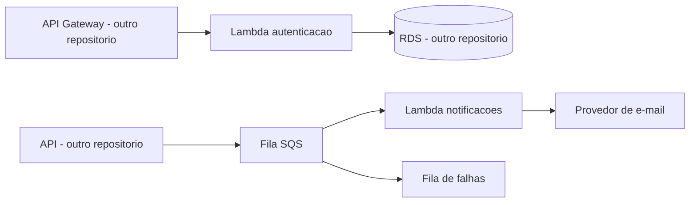

# Base Terraform serverless

Esta pasta define apenas variaveis validadas e nomes planejados das funcoes.
Nao possui provider AWS, backend remoto, funcoes Lambda, IAM, fila ou DLQ.
Um `terraform validate` aprovado confirma a consistencia dessa base, nao um deploy.

## Validar localmente

Requer Terraform >= 1.6 e < 2.0. Na raiz deste repositorio:

```powershell
terraform -chdir=infra fmt -check -recursive
terraform -chdir=infra init -backend=false -input=false
terraform -chdir=infra validate
```

O arquivo `terraform.tfvars.example` mostra a nomenclatura e os ambientes.
Arquivos `*.tfvars`, planos e estados reais sao ignorados pelo Git.

## Responsabilidades futuras

- Este repositorio: funcoes de autenticacao/notificacao, IAM especifico, fila e DLQ.
- Infra Kubernetes: rede, EKS, API Gateway e integracoes com os destinos publicados.
- Infra database: RDS e configuracoes do banco gerenciado.
- API: schema/migrations e publicacao confiavel dos eventos da OS.

Rede, banco e segredos devem existir antes do deploy das funcoes. O estado remoto
e a identidade OIDC das pipelines serao preparados na etapa de nuvem.
A pipeline atual nao executa plan/apply e nao solicita credenciais AWS.

## Arquitetura planejada



Os componentes AWS do diagrama ainda serao implementados.
